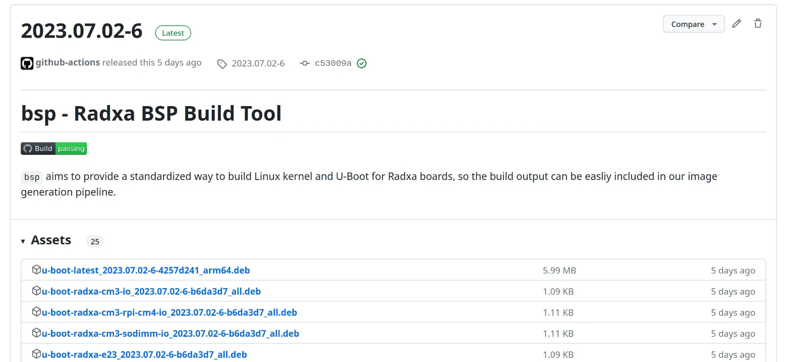

# Update firmware

## Download and extract prebuilt firmware

If you do not want to build the firmware from source, you can also use our [prebuilt firmwares](https://github.com/radxa-pkg?q=u-boot-&type=public&language=&sort=).

Please first go to their latest release and find your product in the asset list:



*Example release from [https://github.com/radxa-pkg/u-boot-latest/releases/latest](https://github.com/radxa-pkg/u-boot-latest/releases/latest)*

You should then download the binary package from the supported release. In our example we will use [`u-boot-latest_2023.07.02-6-4257d241_arm64.deb`](https://github.com/radxa-pkg/u-boot-latest/releases/download/2023.07.02-6/u-boot-latest_2023.07.02-6-4257d241_arm64.deb) as an example.

```admonish tip
If you don't know what is binary package, please read [Build artifacts](artifacts.md) section.
```

```bash
mkdir extract
cd extract
wget https://github.com/radxa-pkg/u-boot-latest/releases/download/2023.07.02-6/u-boot-latest_2023.07.02-6-4257d241_arm64.deb
ar vx *.deb
tar xvf data.tar.xz
ls usr/lib/u-boot/
```

You should see output similar to this:

```bash
[excalibur@yuntian extract]$ ls usr/lib/u-boot/
radxa-cm3-io          radxa-e23  radxa-zero       rock-3a  rock-4-core-io  rock-pi-4a       rock-pi-4b-plus  rock-pi-s
radxa-cm3-rpi-cm4-io  radxa-e25  radxa-zero-2pro  rock-3b  rock-4c-plus    rock-pi-4a-plus  rock-pi-4c
radxa-cm3-sodimm-io   radxa-e61  radxa-zero3      rock-3c  rock-4se        rock-pi-4b       rock-pi-n10
```

This means the firmware is extracted and is ready to use.

## Update firmeware existing system

To install the firmware to an existing system image (must be uncompressed raw image), or a block device (ex. microSD card), you can use the included `setup.sh`. With ROCK 4SE as an example:

```bash
sudo usr/lib/u-boot/rock-4se/setup.sh update_bootloader ~/system.img # Update a system image
# OR
sudo usr/lib/u-boot/rock-4se/setup.sh update_bootloader /dev/sdX # Update a block device
```

You can read more abour `setup.sh` from [its own page](firmware/setup_sh.md).
